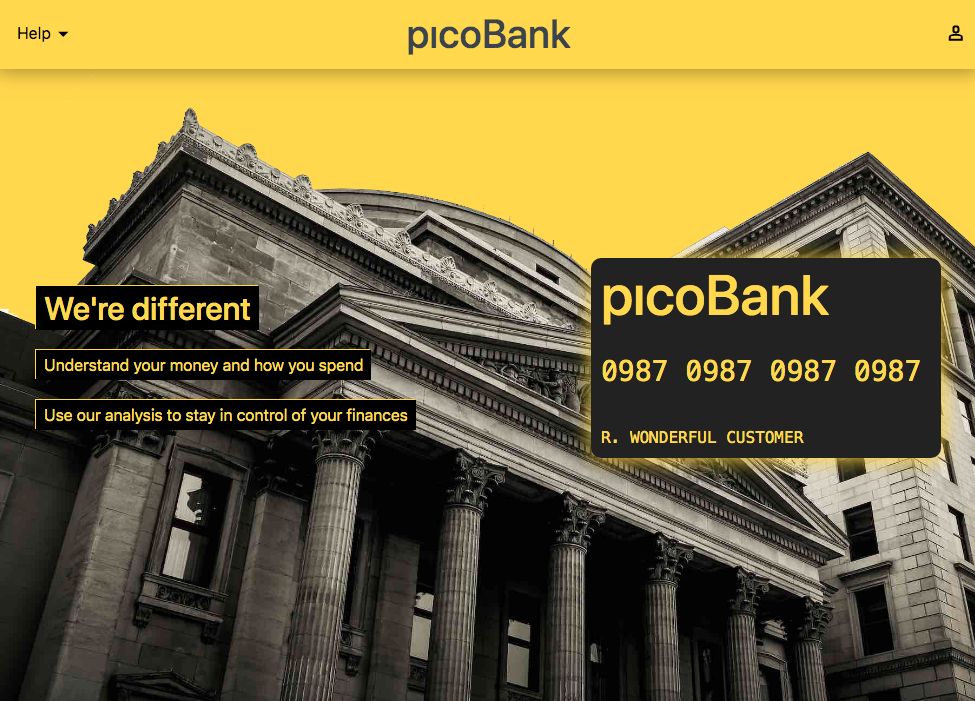
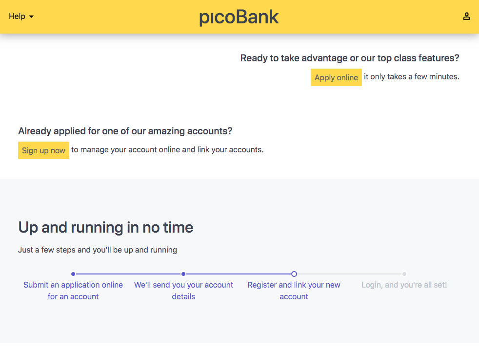
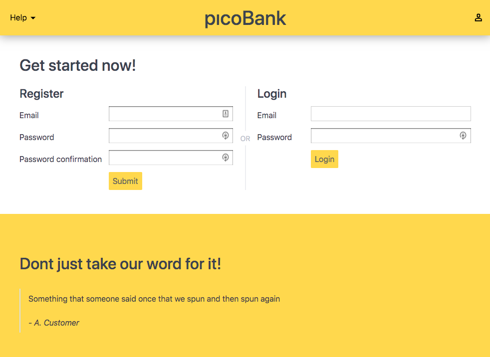
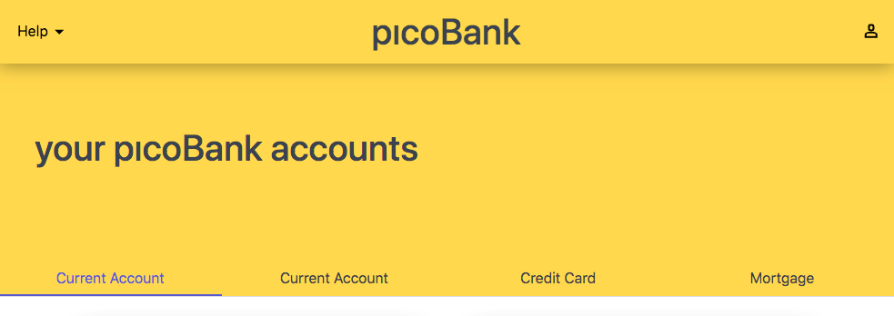
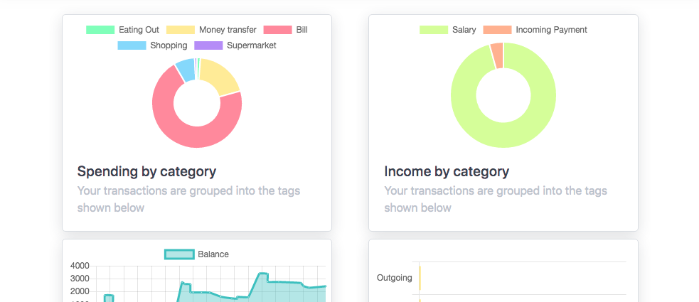
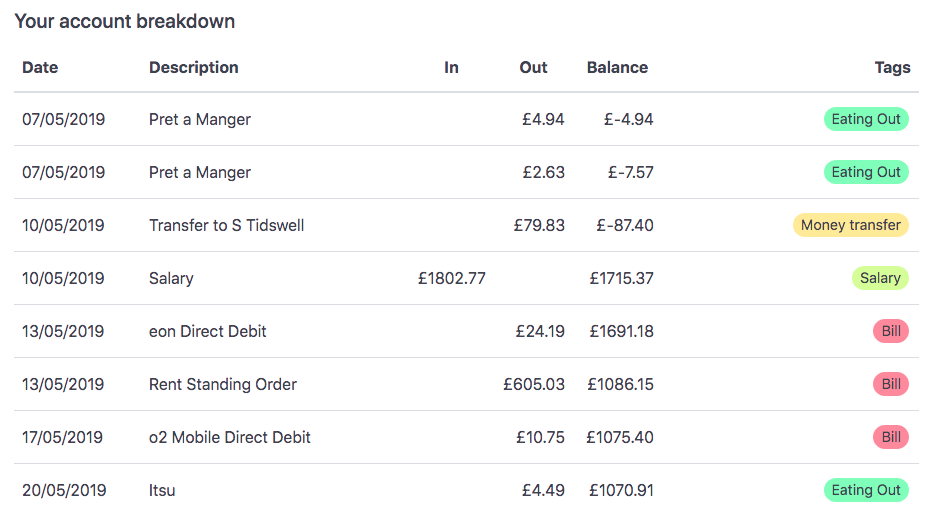
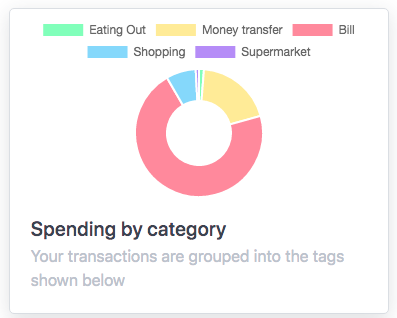
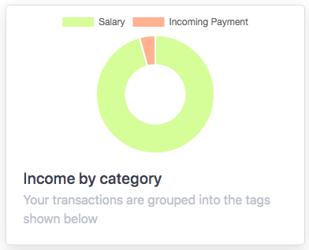
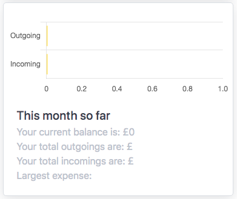

# picoBank

I wanted to create an App which could showcase primarily that I could explore the development of a full stack application which was underpinned with Python in the back-end. Up until this point I have mostly worked on social-style applications, where users would post content and browse other user's content; I wanted this project to be different. 

This was a solo project so all the work you see documented here is my own. The [first version](#v1) of this app was created in one week, with a subsequent version worked towards on an ad-hoc basis over the following month.

## Built With

* **Front-end**
  * [React](https://reactjs.org/)
  * [Chart.js](https://www.chartjs.org/) - for brightening up the customer analysis
  * [Spectre](https://picturepan2.github.io/spectre/getting-started.html) - CSS Framework
* **Back-end**
  * [Python](https://www.python.org/)
  * [Flask](https://palletsprojects.com/p/flask/) - for helping with the routes
  * [Marshmallow](https://palletsprojects.com/p/flask/) - serialisation
  * [SQLAlchemy](https://www.sqlalchemy.org/) - ORM
  * [PostgreSQL](https://www.sqlalchemy.org/) - database

## Key Functionality

I'm very proud of the capability and user experience I managed to pack into this project. picoBank was created to demonstrate that I could integrate different types of application concepts like:
  * customer spending analysis, which I integrated and included alongside some interactive charts
  * instant-style messaging of customer support
  * linking accounts for the same customer
  * complex database seeding of customer data with random transactions, bills and salary payments

## Overview

### Home page
The home page is designed to be a landing page for all incoming customers if they are not logged in. From this page they can log in or register, and also view some marketing information about the bank.







### User Menu
The content of the user menu switches once the user has logged in. In a non-logged in state, the user sees links to log in or register, which just scrolls them down the main page:


In a logged in state, the user has options to see their accounts (the home page for a logged in user), to see the account settings and link page, or to log out:


### Account page

The account page is the default logged in view. Once there, the user can see:

* their different accounts
  
  

* the selected account's analysis
  
  

* the selected account's transactions
  
  


#### Account transactions

The transactions are the individual items which the database stores for the account. They each have a date, a description, a value, and categories. The balance is computed at runtime on the client side. 

The categories can be clicked and act as filters to see only that type of transaction in the table:


#### Account analysis
The account analysis is achieved by computing different metrics from the raw account transaction data. There are four different types of analysis offered:

* Spending by category



* Income by category



* Balance over time


* This month summary with largest expense




This analysis is all run in the front end. The first two are very similar, and use the same function for computation, the request is just altered to request 'debits' or 'credits'. Here is an example of how all the transactions are summed and reduced into a single object, with their individual categories (there can be multiple for each transaction) used as the keys:

````
  aggregateCategoriesAndSpend(transactions, type){
    //reduce the categories into an object to grab unique values
    return transactions.reduce((acc, trans) => {
      // filter by either credits or debits, depending on the request
      if(type === 'debits' && trans.amount > 0) return acc
      if(type === 'credits' && trans.amount < 0) return acc

      //make sure we include all categories
      trans.categories.forEach(({category}) => {
        // either create the key or add to it
        category in acc ? acc[category] += trans.amount : acc[category] = trans.amount
        // get rid of those pesky floating point maths errors by rounding its multiple of 100, then dividing
        acc[category] = Math.round(acc[category]*100)/100
      })
      return acc
    },{})
  }
````

The resulting data is graphed using a Chart.js plugin for react, [react-chartjs-2](https://github.com/jerairrest/react-chartjs-2).


### Linking account page

The linking account page is the most complex of all. As picoBank is not a real bank(!), I needed to seed the database with new account data on the fly if the user decided to attempt this. If the user already has 3 accounts linked, the back-end will respond with a 404 no account found message to the request. This is to restrict the user from having an unmanagable number of accounts.

When a user with less than 3 accounts attempts to link an account by "searching", the back-end will create a new account, link it to the user object, and seed it full of randomised transactions from a number of different categories (small, medium, large, regular bills, outgoing payments, incoming payments and salary):

```
    if len(user.accounts) < 3:
        account_data = Account(type="Current Account", owner_id=user.id)
        cat_data = TransCategory.query.all()
        new_trans = add_transactions_rnd(
            account=account_data, 
            categories=cat_data, 
            number={"small":10, "medium":5, "large":3}, 
            days=92)
        new_trans.extend(add_transactions_bills(
            account=account_data, categories=cat_data, bills=True, days=92))

        for trans in new_trans:
            db.session.add(trans)
    
        db.session.add(account_data)
        db.session.commit()
```


---

## Getting started with a local copy

To get a copy of this project up and running on your local machine, you will need to follow these steps. Later I will follow this up with notes on how to deploy the project on a live system.

### Prerequisites

I have been using yarn as my package manager, and so all the steps below are using that, but npm can also be used.

### Installing

1. Initiate the project and install the dependencies:

```
yarn
```

2. Seed the database:

```
yarn seed
```

3. Launch the back-end:

```
yarn serve:back
```

4. Keep that terminal session running and create a new one (on a Mac: cmd + t) then launch the front-end:

```
yarn serve:front
```
It's now ready to access on the [localhost](https://localhost:8000).


## Running the tests

Explain how to run the automated tests for this system

### Break down into end to end tests

Explain what these tests test and why

```
Give an example
```


## Versioning

#### v1
One week project, ended with a demo and presentation. MVP was complete, but support accounts were not yet enabled, so two way chat was not possible.

#### v2
...


## Acknowledgments

* Thanks to General Assembly for a little suport through this project
* I was inspired by the new challenger type banks including Monzo and Revolut